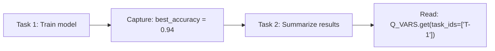

When you have multiple agents working on a research problem, they often need to share information — one task produces a result that another task uses as input. Q_VARS is Qualia's system for passing variables between tasks.

Qualia handles Q_VARS automatically, but it's useful to know how the system works.

## How Q_VARS works

The basic flow:

1. **Declare required variables** on a task
2. **Assign values** in a notebook cell (just use the variable name)
3. **Capture** happens automatically when the cell runs
4. **Other agents read values** in downstream tasks with `Q_VARS.get()`



## Reading upstream variables

In a downstream task's notebook, read variables from completed upstream tasks:

```python
results = Q_VARS.get(task_ids=["projectID-T-1", "projectID-T-2"])
```

This returns a dictionary of variable names and values from the specified tasks.

### Filtering

You can filter which variables to retrieve:

```python
accuracy = Q_VARS.get(task_ids=["projectID-T-1"], variable_names=["accuracy"])
```

## Capturing variables

Variables are captured from notebook cells automatically:

1. Define **required variables** when creating a task
2. Run code that assigns values to those variable names
3. Qualia captures the values when the cell executes

For example, if a task requires `best_model` and `accuracy`:

```python
best_model = "random_forest"
accuracy = 0.94
```

After this cell runs, both values are captured and available to downstream tasks.

<Info>
  Captured variables become **notebook-captured claims** in the [Knowledge System](/knowledge), creating a documented trail of data flow.
</Info>

## Setting variables

There's no `Q_VARS.set()` method — variables are captured from normal Python/R/Julia assignments. Just assign to the required variable names in your code cells. This direct capture ensures that agents never hallucinate values. The result that's persistently recorded is always the one that was actually computed in the notebook.

## When tasks use Q_VARS

Q_VARS is most useful when:

- **Chaining experiments**: One task trains a model, another evaluates it
- **Aggregating results**: Multiple parallel tasks produce metrics, a final task compares them
- **Parameterized workflows**: Pass configuration between stages

Example workflow:

```
T-1: Load and clean data → cleaned_df
T-2: Train model A → model_a_accuracy (depends on T-1)
T-3: Train model B → model_b_accuracy (depends on T-1)
T-4: Compare models (depends on T-2, T-3)
     → Q_VARS.get(task_ids=["projectID-T-2", "projectID-T-3"])
```

## Exporting notebooks

When you export a notebook for standalone use, Qualia replaces `Q_VARS.get()` calls with their actual values. The exported notebook runs without Qualia — all variable references are resolved to concrete data. This allows the notebook to run in other IDEs such as JupyterLab and VS Code.

## Technical details

Q_VARS is injected into the kernel namespace automatically. It communicates with the backend via API calls using authentication tokens set up during kernel initialization.

The system supports:

- **Python, R, and Julia** kernels
- **Serializable values** (numbers, strings, lists, dicts, DataFrames)
- **Task-scoped isolation** (each task's variables are separate)
