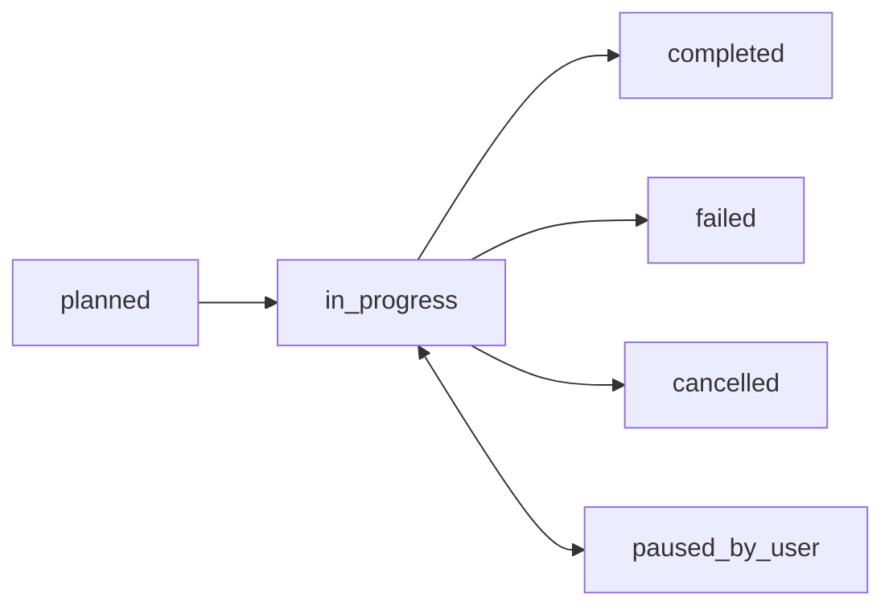

When you're working on complex research with multiple steps and dependencies, Qualia's task system helps you organize the work. Tasks form a directed acyclic graph (DAG) where each task can depend on others and be assigned to different agents.

## Understanding tasks

A task represents a unit of work:

- **Title**: What needs to be done
- **Objective**: Detailed description of the goal
- **Status**: Where the task is in its lifecycle
- **Dependencies**: Other tasks that must complete first
- **Assignment**: Which agent is working on it

Tasks are identified by IDs like `T-1`, `T-2`, etc. within a project.

## Task statuses

Tasks move through a defined lifecycle:

| Status | Meaning |
|--------|---------|
| **planned** | Task is defined but not yet started |
| **in_progress** | An agent is actively working on it |
| **completed** | Task finished successfully |
| **failed** | Task encountered an error |
| **cancelled** | Task was stopped before completion |
| **paused_by_user** | You paused the task; can be resumed |

### Blocking

Tasks can be **blocked** when they depend on upstream tasks that haven't completed yet. Blocking is tracked separately from status — a planned task may be blocked or unblocked depending on whether its dependencies are satisfied. When upstream tasks complete, blocked tasks automatically become unblocked and available to start.

## The Tasks sidebar

Open the **Tasks** sidebar from the activity bar (far left) to see your project's task graph.

### Views

Toggle between two views:

- **Gantt view**: Timeline showing tasks by assignee, with dependency lines connecting related tasks
- **DAG view**: Graph visualization of task dependencies

### Creating tasks

Click **New tasks** to describe work in natural language. Qualia analyzes your description and creates a structured task graph:

> *"Analyze this dataset: clean the data, run three different models, compare their performance, and summarize the best approach."*

This creates multiple linked tasks with appropriate dependencies.

### Modifying and deleting tasks

You can edit or remove **planned** tasks before they start:

- **Edit**: Click a planned task to modify its title, objective, or dependencies
- **Delete**: Remove tasks that are no longer needed

Once a task moves to **in_progress**, it can no longer be edited or deleted — pause it first if you need to make changes.

### Reassigning tasks

In Gantt view, drag a task bar to reassign it:

- Drop on another agent's row to reassign to that agent
- Drop on **New agent** to create a new agent for the task

Terminal tasks (completed, failed, cancelled) cannot be reassigned.

## Tasks and agents

Tasks and [agents](/agents) work together:

- Agents can have multiple tasks assigned to them
- An agent works through its tasks, respecting dependencies
- When you create parallel agents, each can take on different tasks

The agent confirmation setting in [Settings > AI](/settings/ai) controls whether new agent creation requires your approval.

## Tasks and knowledge

When an agent completes a task, it typically produces **claims** in the [Knowledge System](/knowledge). This claim captures what the agent learned or concluded, with links back to the evidence (code cells, files, other claims).
## Viewing task progress

### Inline summary

In the Chat sidebar, each agent shows a collapsible task summary:

- Count of tasks by status (completed, in progress, planned, etc.)
- Click to expand and see individual tasks
- Link to open the full Tasks view

### Project selector

If you have multiple projects, use the project selector at the top of the Tasks sidebar to switch between them.
